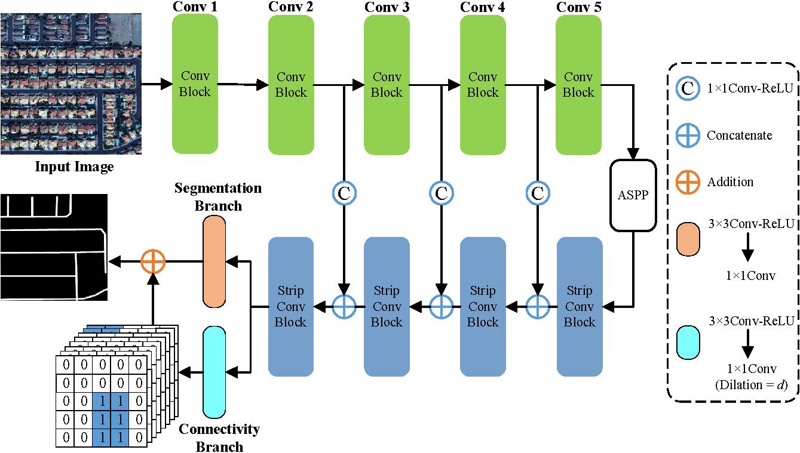
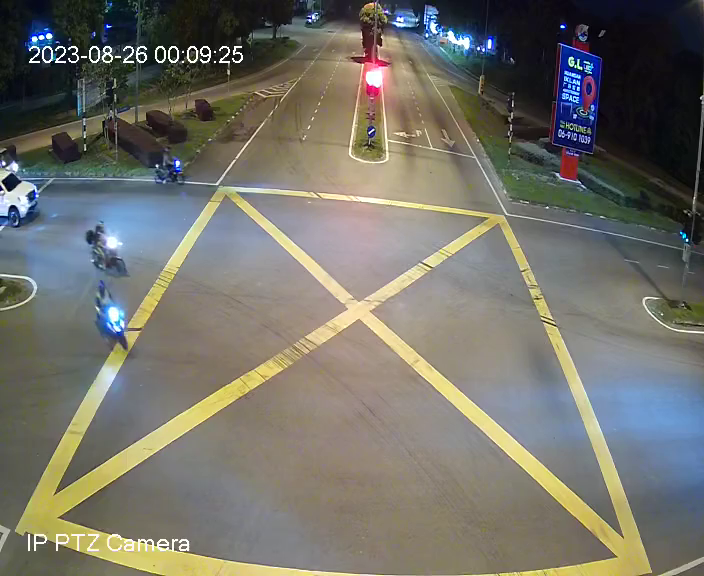

## Semantic Segmentation using CoANet

### Introduction

Semantic segmentation is a fundamental task in computer vision, and it plays a crucial role in various applications, including autonomous driving, medical imaging, and video analysis. At its core, semantic segmentation involves labelling each pixel in an image or frame of a video with a class label that represents the object or region it belongs to. This means that every pixel is assigned a meaningful category, such as "car," "tree," "road," or "person."

In the context of pre-recorded videos, semantic segmentation becomes even more powerful. It enables us to understand the visual content of each frame in detail, allowing for tasks like object tracking, scene understanding, and even real-time decision-making in applications like surveillance and augmented reality.




### Requirements

The code is built with the following dependencies:

- Python 3.6 or higher
- CUDA 10.0 or higher
- [PyTorch](https://pytorch.org/) 1.2 or higher
- [tqdm](https://github.com/tqdm/tqdm.git)
- matplotlib
- pillow
- tensorboardX

### Data Preparation
#### Pre-process Dataset
- Extract frame from the video using OpenCV.
```
python extract_frame.py
```
- Do the data annotation on the video labelling out the road manually.




- Perform data augmentation on both ground truth image and original image and split them into train, test and val.
```
python data_augmentation.py
```

*Dataset tree structure after preprocessing.*

```
Dataset name
|
└───train
│   └───gt
│       └───frame0000_gt.png
│   └───images
│       └───frame0000_sat.png
└───test
│   └───gt
│       └───frame0000_gt.png
│   └───images
│       └───frame0000_sat.png
└───val
│   └───gt
│       └───frame0000_gt.png
│   └───images
│       └───frame0000_sat.png
└───video
│   └───stream0.ts
│
└───video_frame
│   └───gt
│       └───frame0000_gt.png
│   └───images
│       └───frame0000_sat.png
```


#### Create connectivity cubes
```
python create_connection.py 
```

*Dataset tree structure after create connection.*

```
Dataset name
|
└───train
│   └───gt
│       └───frame0000_gt.png
│   └───images
│       └───frame0000_sat.png
└───test
│   └───gt
│       └───frame0000_gt.png
│   └───images
│       └───frame0000_sat.png
└───val
│   └───gt
│       └───frame0000_gt.png
│   └───images
│       └───frame0000_sat.png
└───video
│   └───stream0.ts
│
└───video_frame
│   └───connect_8_d1
│       └───frame0000_gt_0.png          #create by create_connection.py
│       └───frame0000_gt_1.png          #create by create_connection.py
│       └───frame0000_gt_2.png          #create by create_connection.py
│   └───connect_8_d3
│       └───frame0000_gt_0.png          #create by create_connection.py
│       └───frame0000_gt_1.png          #create by create_connection.py
│       └───frame0000_gt_2.png          #create by create_connection.py
│   └───gt
│       └───frame0000_gt.png
│   └───images
│       └───frame0000_sat.png
```


### Testing
The pretrained model of CoANet can be loaded from:
```
ckpt = torch.load(r'.\run\model\model_best.pth.tar')
```

- Modify the result folder name before performing testing 
```
base_path = r'.\out_imgs_1300'
dataset_name = args.dataset  
result = 'result1'  # Replace 'result1' with the actual result1 value
```

- The reuslt image will be saved based on the file directory
```
def save_image(tensor, filename, nrow=8, padding=2,
               normalize=False, range=None, scale_each=False, pad_value=0):
    from PIL import Image
    grid = make_grid(tensor, nrow=nrow, padding=padding, pad_value=pad_value,
                     normalize=normalize, range=range, scale_each=scale_each)
    ndarr = grid.mul_(255).add_(0.5).clamp_(0, 255).permute(1, 2, 0).to('cpu', torch.uint8).numpy()
    im = Image.fromarray(ndarr)
    im = im.resize([280, 280])
    im.save(filename)
```
- Best accuracy will be record and saved as .txt format
```
        if mIoU > best_mIoU:
            best_acc = Acc
            best_acc_class = Acc_class
            best_mIoU = mIoU
            best_IoU = IoU
            best_precision = Precision
            best_recall = Recall
            best_f1 = F1

    print("Best Accuracy:")
    print("Acc:{}, Acc_class:{}, mIoU:{}, IoU:{}, Precision:{}, Recall:{}, F1:{}"
          .format(best_acc, best_acc_class, best_mIoU, best_IoU, best_precision, best_recall, best_f1))

    # Save the best accuracy values to a .txt file
    with open(os.path.join(out_path, 'Best_accuracy.txt'), 'w') as f:
        f.write("Best Accuracy:\n")
        f.write("Acc:{}, Acc_class:{}, mIoU:{}, IoU:{}, Precision:{}, Recall:{}, F1:{}\n"
                .format(best_acc, best_acc_class, best_mIoU, best_IoU, best_precision, best_recall, best_f1))
```


Run the following scripts to evaluate the model.
```
python test.py 
```

### Training
Follow steps below to train your model:

1. Configure your dataset path in [mypath.py] and also in these python file :
```
Changing dataset name in these file: 
- data_augmentation.py
- create_connection.py
- tia.py
- tia_crop.py
- test.py
- train.py
```

- Modify hyperparameter and argument before training
```
class Args:
    def __init__(self):
            self.no_cuda = False
            self.batch_size = 2
            self.cuda = not self.no_cuda and torch.cuda.is_available()
            # self.gpu_ids = []  # Use an empty list to indicate using all available GPUs
            self.gpu_ids = ''  # Use an empty list to indicate not using GPUs
            # self.gpu_ids = [0]  # Use an empty list to indicate using one  GPUs    
            self.dataset = '7b52009b64fd0a2a49e6d8a939753077792b0554'
            self.base_size = 280
            self.crop_size = 280
            # self.base_size = 512
            # self.crop_size = 512
            self.sync_bn = False
            self.freeze_bn = False
            self.backbone = 'resnet'
            self.out_stride = 8
            self.loss_type = 'con_ce'
            self.epochs = 1
            self.start_epoch = 0
            self.use_balanced_weights = False
            self.lr = 0.01
            self.lr_scheduler = 'poly'
            self.momentum = 0.9
            self.weight_decay = 5e-4
            self.nesterov = False
            self.seed = 1
            self.resume = None
            self.checkname = None
            self.ft = False
            self.eval_interval = 1
            self.no_val = False
            self.workers = 16
```

2. To train CoANet using ResNet as backbone:
```
python train.py 
```

- Dataset will be split to subset for training purpose
```
# Create subsets and loaders for each subset
        for i in range(self.num_subsets):
            start_idx = i * self.max_subset_size
            end_idx = (i + 1) * self.max_subset_size

            subset = Subset(self.train_loader.dataset, list(range(start_idx, end_idx)))
            subset_loader = DataLoader(subset, batch_size=args.batch_size, shuffle=True, num_workers=args.workers, pin_memory=True)

            self.subset_loaders.append(subset_loader)

            print(f"Subset {i+1}: Number of images = {len(subset_loader.dataset)}")

         if self.remaining_images > 0:
            start_idx = self.num_subsets * self.max_subset_size
            end_idx = self.num_subsets * self.max_subset_size + self.remaining_images

            last_subset = Subset(self.train_loader.dataset, list(range(start_idx, end_idx)))
            last_subset_loader = DataLoader(last_subset, batch_size=args.batch_size, shuffle=True, num_workers=args.workers, pin_memory=True)

            self.subset_loaders.append(last_subset_loader)
            
            print(f"Number of images in last subset = {len(last_subset_loader.dataset)}")  
```

- Resuming the checkpoint 
```
# Resuming checkpoint
        self.best_pred = 0.0
        if args.resume is not None:
            if not os.path.isfile(args.resume):
                raise RuntimeError("=> no checkpoint found at '{}'" .format(args.resume))
            checkpoint = torch.load(args.resume)
            args.start_epoch = checkpoint['epoch']

            if args.cuda:
                self.model.load_state_dict(checkpoint['state_dict'])
                # self.model.module.load_state_dict(checkpoint['state_dict'])
            else:
                self.model.load_state_dict(checkpoint['state_dict'])
            if not args.ft:
                self.optimizer.load_state_dict(checkpoint['optimizer'])
            self.best_pred = checkpoint['best_pred']
            print("=> loaded checkpoint '{}' (epoch {})"
                  .format(args.resume, checkpoint['epoch']))
```

- Saving the checkpoint
```
def save_checkpoint(self, state, is_best, filename='checkpoint.pth.tar'):
        """Saves checkpoint to disk"""
        filename = os.path.join(self.experiment_dir, filename)
        
        # Check if you are using CUDA and DataParallel
        if self.args.cuda and self.args.gpu_ids:
            # Modify the state_dict to remove the "module" prefix
            state_dict = state['state_dict']
            new_state_dict = {}
            for key, value in state_dict.items():
                new_key = key.replace("module.", "")  # Remove the "module" prefix
                new_state_dict[new_key] = value
            state['state_dict'] = new_state_dict
        
        # Save the modified state_dict
        torch.save(state, filename)
        
        if is_best:
            best_pred = state['best_pred']
            with open(os.path.join(self.experiment_dir, 'best_pred.txt'), 'w') as f:
                f.write(str(best_pred))
            if self.runs:
                previous_miou = [0.0]
                for run in self.runs:
                    run_id = run.split('t_')[-1]
                    path = os.path.join(self.directory, 'experiment_{}'.format(str(run_id)), 'best_pred.txt')
                    if os.path.exists(path):
                        with open(path, 'r') as f:
                            miou = float(f.readline())
                            previous_miou.append(miou)
                    else:
                        continue
                max_miou = max(previous_miou)
                if best_pred > max_miou:
                    shutil.copyfile(filename, os.path.join(self.saved_directory, 'model_best.pth.tar'))
            else:
                shutil.copyfile(filename, os.path.join(self.saved_directory, 'model_best.pth.tar'))
```
